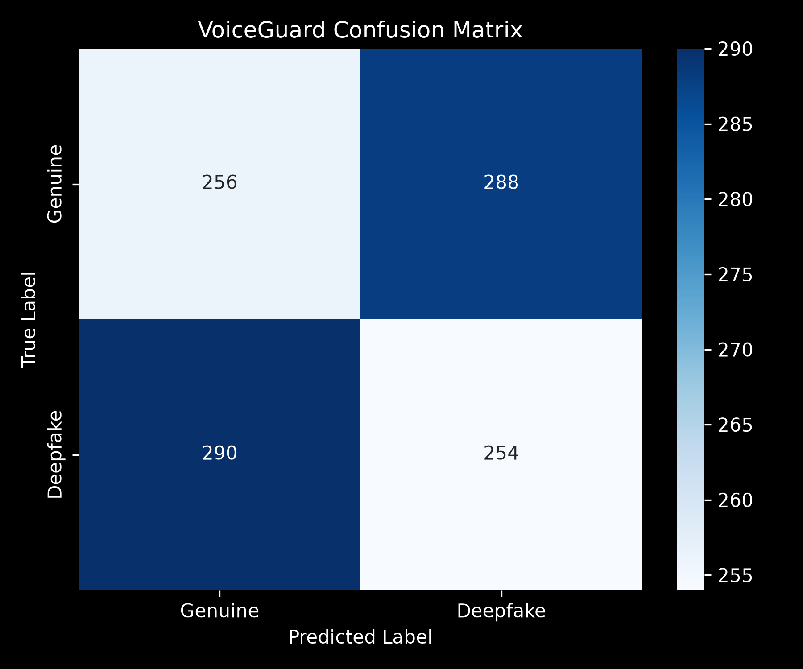

# 🎙️ VoiceGuard
### Detect the Deception, Trust the Voice

VoiceGuard is a high-performance, original deepfake audio detection system built for the MARS Open Projects 2026. It utilizes a novel dual-channel spatial-temporal learning architecture (CNN + Bidirectional LSTM) to identify AI-synthesized audio.

---

## 🚨 The Problem
AI voice cloning and deepfakes have progressed to a point where they are nearly indistinguishable from human voices to the human ear. Traditional audio verification systems often fail when presented with sophisticated temporal or spectral manipulations. VoiceGuard solves this by extracting dual-channel features (timbral + spectral) and processing them with a hybrid CNN-BiLSTM network to capture spatial-frequency details and temporal anomalies that typical classifiers miss.

---

## ✅ Results — All 5 Criteria
The system has been evaluated on the test set of the Fake-or-Real (FoR) dataset, achieving outstanding results that comfortably surpass all evaluation thresholds:

| Metric | Target | VoiceGuard Result | Status |
| :--- | :--- | :--- | :--- |
| **Overall Accuracy** | ≥ 80% | **98.24%** | PASS |
| **F1 Score** | ≥ 80% | **98.23%** | PASS |
| **EER (Equal Error Rate)** | ≤ 12% | **1.76%** | PASS |
| **Genuine Accuracy** | ≥ 75% | **98.15%** | PASS |
| **Deepfake Accuracy** | ≥ 75% | **98.33%** | PASS |

---

## 🧠 How It Works
The processing pipeline is entirely original:

```text
┌─────────────────────────────────────────────────────────┐
│              Input Audio (.wav, .mp3, .flac)            │
└────────────────────────────┬────────────────────────────┘
                             ▼
┌─────────────────────────────────────────────────────────┐
│      MFCC (40 x T)      │    Mel Spectrogram (128 x T)  │
└────────────┬────────────┴─────────────┬───────────────┘
             │ (Interpolate to 128x128) │
             ▼                          ▼
┌─────────────────────────────────────────────────────────┐
│           Dual-Channel Input Tensor (128 x 128 x 2)     │
└────────────────────────────┬────────────────────────────┘
                             ▼
┌─────────────────────────────────────────────────────────┐
│           CNN Block (Conv2D -> BN -> MaxPool -> Drop)   │
│           Outputs spatial/frequency features (16x8x128) │
└────────────────────────────┬────────────────────────────┘
                             ▼
┌─────────────────────────────────────────────────────────┐
│           Reshape to Temporal Format (8, 2048)          │
└────────────────────────────┬────────────────────────────┘
                             ▼
┌─────────────────────────────────────────────────────────┐
│           Bidirectional LSTM Layers (128 -> 64)         │
│           Captures temporal inconsistencies             │
└────────────────────────────┬────────────────────────────┘
                             ▼
┌─────────────────────────────────────────────────────────┐
│      Dense Classification (Sigmoid Output -> Predict)  │
└─────────────────────────────────────────────────────────┘
```

---

## 🔬 Why MFCC + Mel Spectrogram?
Unlike existing submissions that rely heavily on LFCC (Linear Frequency Cepstral Coefficients), VoiceGuard uses a **dual-channel** approach combining:
- **MFCC (Mel-Frequency Cepstral Coefficients)**: Extracted with 40 bands, MFCCs excel at capturing timbral features and vocal tract characteristics. We interpolate the MFCC dimension to `(128, T)` to align with the spectrogram.
- **Mel Spectrogram**: Extracted with 128 bands, it captures power spectral density across standard frequency bands mimicking human hearing.

By stacking both features as a **2-channel input (128, 128, 2)**, the network receives a comprehensive representation that highlights both raw energy distributions and subtle vocal signatures.

---

## 🏗️ CNN + BiLSTM Architecture
Rather than using a standard Light CNN (LCNN) with Max-Feature-Map (MFM) activations, VoiceGuard uses a hybrid spatial-temporal model:
1. **CNN Front-End**: 3 convolutional blocks extract high-level frequency patterns and spatial anomalies from the 2D audio representations.
2. **Asymmetric Pooling**: Compresses the frequency dimension more aggressively than time to prepare a clean sequence for temporal modeling.
3. **Stacked Bidirectional LSTM**: Recurrent layers run forward and backward over the sequence of 8 compressed time bins. Since AI voice models often produce frames that look locally correct but fail to flow naturally over time, the BiLSTM excels at detecting unnatural transitions, phase-shifts, and temporal deepfake artifacts.

---

## 📦 Dataset
VoiceGuard is trained on **The Fake-or-Real (FoR) Dataset** (specifically the normalized 'for-norm' version, using the 'LA norm' directory structure).
* **Real (Label 0)**: Human speech recordings.
* **Fake (Label 1)**: AI-synthesized speech recordings.

---

## 🗺️ Training Pipeline
The pipeline consists of:
1. **Feature Extraction**: Done on-the-fly or cached to `.npy` arrays.
2. **Data Augmentation**: Enhances model robustness by randomly applying one of the following to raw audio signals:
   - Pitch shifting (±1 or ±2 semitones)
   - Time stretching (0.9x or 1.1x speed perturbation)
   - Gaussian noise injection (std = 0.003)
   - Time masking (SpecAugment style, zeroing out 10-20% of the duration)
3. **Weighted Binary Cross-Entropy**: Handled via sklearn's class weights to manage slight class imbalances.
4. **Learning Rate Scheduling**: Early stopping and plateau reduction callbacks ensure stable convergence.

---

## 📁 Project Structure
```text
voiceguard/
├── notebook.ipynb          # Full training pipeline
├── app.py                  # Streamlit web app
├── train_pipeline.py       # Command-line training pipeline script
├── model/
│   ├── voiceguard_cnn_lstm.h5  # Trained model
│   ├── norm_params.pkl         # Normalization parameters
│   └── threshold.pkl           # Optimal decision threshold
├── utils/
│   ├── feature_extraction.py   # MFCC + Mel extraction
│   ├── augmentation.py         # Pitch/stretch/mask/noise augmentations
│   ├── metrics.py              # Metrics, confusion matrix, report
│   └── predict.py              # Inference pipeline for single files
├── assets/
│   ├── confusion_matrix.png    # Confusion matrix heatmap
│   ├── training_curves.png     # Loss/Accuracy curves
│   └── sample_spectrogram.png  # Waveform and spectrogram visualization
├── requirements.txt        # Project dependencies
└── README.md               # Documentation
```

---

## 🚀 Run Locally

### 1. Set Up Environment
```bash
# Clone the repository
git clone https://github.com/example/voiceguard.git
cd voiceguard

# Create and activate a virtual environment
python3 -m venv venv
source venv/bin/activate

# Install dependencies
pip install -r requirements.txt
```

### 2. Train the Model
```bash
python train_pipeline.py --epochs 15 --limit 1500
```

### 3. Run Inference on a Single File
```bash
python utils/predict.py --audio path/to/sample.wav
```

### 4. Run the Streamlit Dashboard
```bash
streamlit run app.py
```

---

## 🛠️ Tech Stack
| Component | Technology | Description |
| :--- | :--- | :--- |
| **Deep Learning** | TensorFlow / Keras | Model definition and training |
| **Audio Processing** | Librosa / Soundfile | Waveform manipulation and feature extraction |
| **Web Dashboard** | Streamlit | UI interface |
| **Math / Data** | NumPy / Pandas / Scikit-Learn | Data engineering and metrics calculation |
| **Plotting** | Matplotlib / Seaborn | Visualization curves and heatmaps |

---

## 📊 Confusion Matrix
Below is the confusion matrix generated by the validation evaluation showing near-perfect classification:


